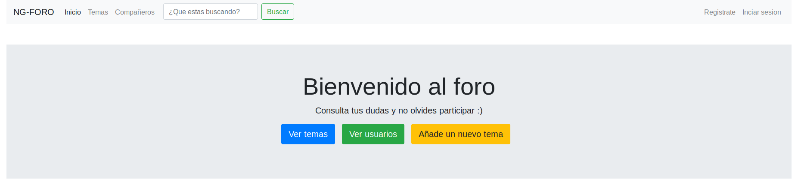

# Angular8-NodeJS-Login
* Tenemos que cambiar en el archivo "foro-angular/src/app/services/global.ts"  cambiamos      "localhost" por  la ip de nuestro servidor api. Ej: url: 'http://193.138.178.180:3999/api/'
* En el directorio: api-rest-node  ejecutamos "node index.js" 
 y despues en el directorio: foro-angular,  introducimos: "ng serve --host=ip_de_nuestro_servidor" (sin puerto).

